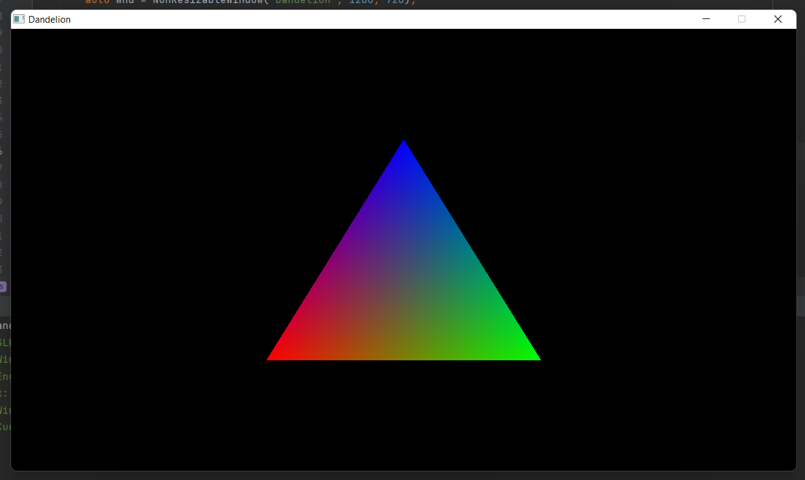

# Dandelion

A graphics engine for rendering 2D and 3D scenes

[](resources/triangle.png)

# Compilation

To compile entire project type following in shell.
```sh
mkdir build
cd build
cmake ..
cmake --build . --config release
```

# Dependencies

[GLFW](https://github.com/glfw/glfw)\
[SPDLOG](https://github.com/gabime/spdlog)